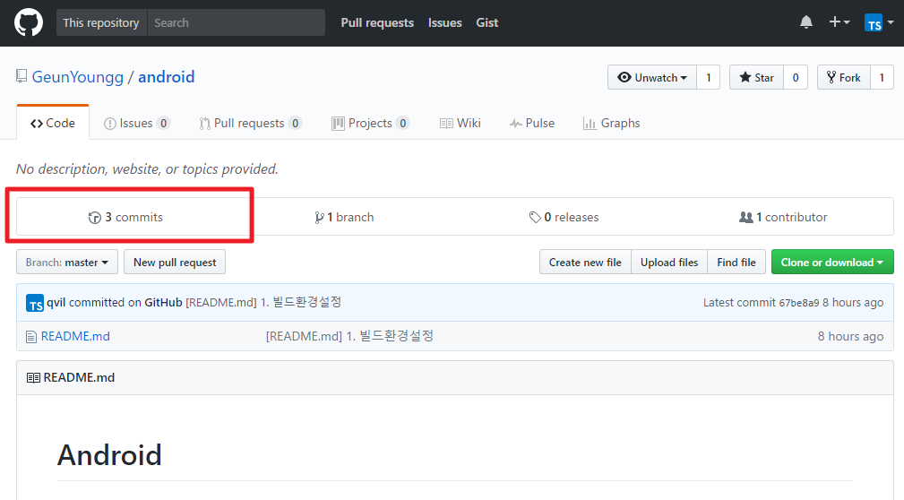
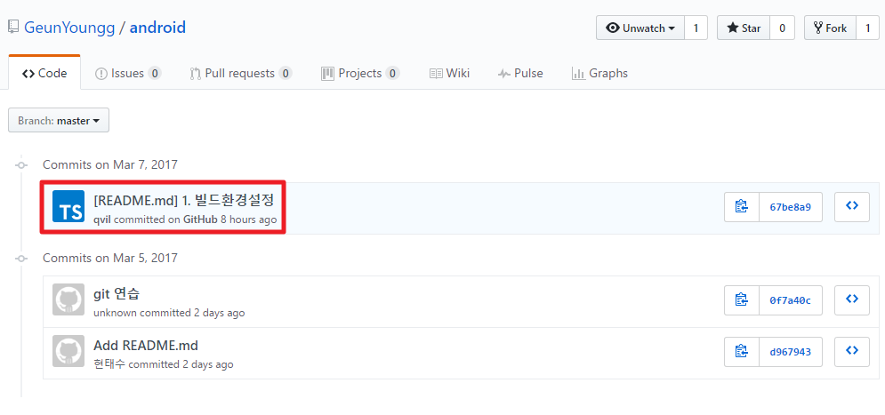
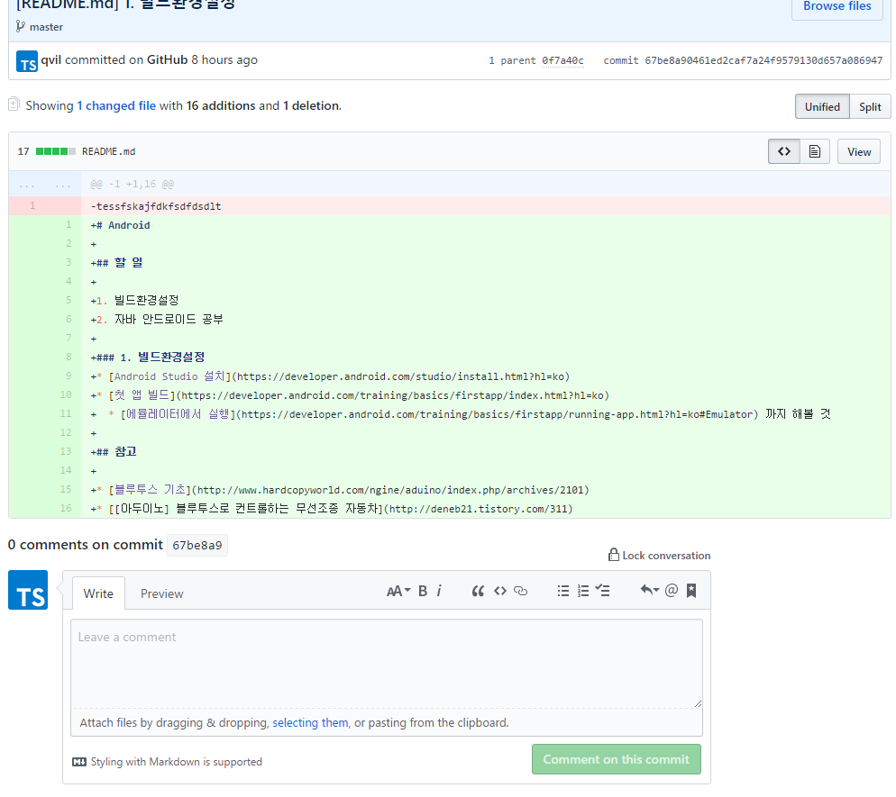

# Android
**졸업작품을 위한 안드로이드 앱 만들기 프로젝트**

* [스터디계획](./study/study-plan.md)
* [스터디기록](./study/study-record.md)
## 목표

이 프로젝트 저장소에 블루투스 연동 안드로이드 앱이 올라오는 것

## 생각해볼 것

1. 피드백
    1. 필요한 이유
        * 우리가 제대로 진행하고 있나 확인하기 위해
    2. 방법
        1. 깃헙
        2. 카톡
    3. 주기
        * 주 1회?
2. 공부방법
    1. 인터넷강의
    2. 책
    3. 스터디방식
        1. 코드리뷰
            * 서로 같은 강의를 듣거나 같은 주제를 공부하고 서로의 코드를 확인함.
        2. 과외
            * 내가 주도적으로 계획을 세워서 과외하듯이 간단한 예제와 숙제 병행
            * [참고(친구 프로그래밍 과외 해줬던거)](https://github.com/qvil/Python)
3. 정보의 기록
    1. 필요한 이유
        * 블루투스 통신 방식이라던가 꼭 코딩에 관련된 것이 아니여도 캡스톤 발표에 필요할 것임
    2. 방법
        * 자신에게 편한 방법으로 공부한거 잘 정리하길

## 할 일

1. 빌드환경설정
2. 자바 안드로이드 공부
3. 안드로이드 앱 만들기

### 1. 빌드환경설정
* [Android Studio 설치](https://developer.android.com/studio/install.html?hl=ko)
* [첫 앱 빌드](https://developer.android.com/training/basics/firstapp/index.html?hl=ko)
  * [에뮬레이터에서 실행](https://developer.android.com/training/basics/firstapp/running-app.html?hl=ko#Emulator) 까지 해볼 것
  
### 2. 자바 안드로이드 공부

* [안드로이드 개발자 공식포럼](https://developer.android.com/training/index.html)
  * 개인적으로 가장 중요하다고 생각해 한글 번역이 일부 되어있지만 공식사이트에 나온대로 하는게 최신 업데이트도 반영되고(인터넷 강의는 시간이 오래되면 안 맞는게 많아) 좋아! 이건 꼭 훑어라도 보길 바래
* [초보부터 개발자 취업까지!! 실전 자바 강좌](https://www.inflearn.com/course/%EC%8B%A4%EC%A0%84-%EC%9E%90%EB%B0%94-%EA%B0%95%EC%A2%8C/)
  * 인프런이라는 곳에서 사람들이 제일 많이 들은 자바 강좌야 이거 들을거면 섹션2 자바 기본까지만 들으면 될 것 같아.
* [예제로 배우는 안드로이드 ANDROID](https://kairo96.gitbooks.io/android/content/ch0.html)

* [Do it! 안드로이드](https://www.youtube.com/watch?v=xO1TlHzZHFU)
  * 교재 동영상 강의 지인이 봤는데 도움 많이 된대! 나는 이거 보려고 ㅋㅋ

### 3. 안드로이드 앱 만들기

추후에 올림.

## 피드백

### 깃헙댓글 다는법

### 깃헙 사용방법
[git 사용방법](./git.md)

## 참고

* [블루투스 기초](http://www.hardcopyworld.com/ngine/aduino/index.php/archives/2101)
* [[아두이노] 블루투스로 컨트롤하는 무선조종 자동차](http://deneb21.tistory.com/311)
