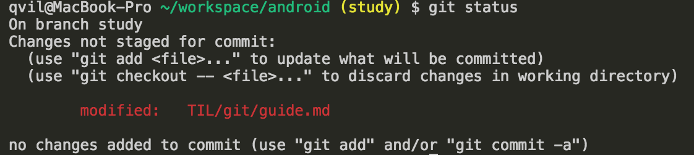
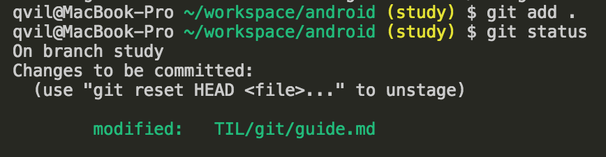
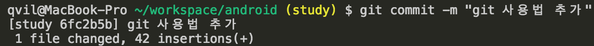
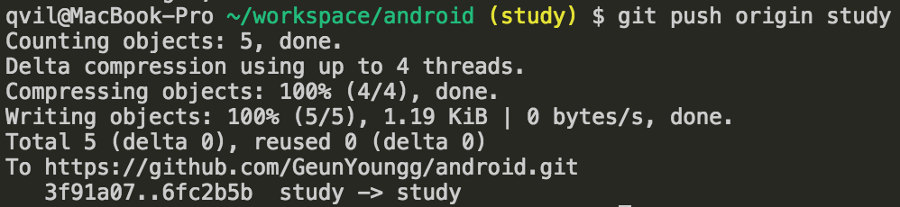

# git 사용법

* git bash 프로그램으로 사용

## 초기설정

### 소스코드가 있는 폴더에서 시작하기

1. 현재 폴더 확인 및 파일, 폴더 목록 확인
```sh
pwd
# 출력 
# /Users/qvil
```
```sh
ls # 일반 list
ls -al # 숨김파일 보는 list
```

2. 작업 폴더로 이동
```sh
cd android # android 폴더로 이동
cd .. # 상위 폴더로 이동
cd ../.. # 두번 상위 폴더로 이동
```

3. 작업 폴더에서 git init
```sh
git init # 현재 폴더에서 git을 사용하겠다.
```

4. git 원격 저장소 추가
```sh
git remote add origin url # git remote저장소를 add 하는데 이름은 origin으로 사용할 것이고 원격저장소 주소는 url 자리에 넣는다
```
예제
```sh
git remote add origin https://github.com/GeunYoungg/android.git
```


### github에서 내려 받은 폴더로 시작하기

1. 저장소 내려받기
```sh
git clone url
```
예제
```sh
git clone https://github.com/GeunYoungg/android.git
```

2. 바로 사용하면 됨. 파일을 전부 교체해도 상관 없음.

## 사용하기

1. git status(상태확인)
```sh
git status
```

2. git add(변경된 상태를 commit할 준비)
```sh
git add . # . 점은 현재 폴더를 칭한다. 현재 폴더부터 모든 변경사항을 add
git add file_name # file_name으로 개별적으로 add 가능
```

3. git commit(변경된 사항에 메세지 남기기)
```sh
git commit -m "git 사용법 추가" # commit 명령 뒤에 -m 옵션을 주고 "" 사이에 텍스트 추가"
```

4. git push(commit까지 완료된 상태를 저장소에 push)
```sh
git push origin master
# git push {원격저장소 이름} {브랜치 이름}
```


## 참고
* [버전관리를 들어본적 없는 사람들을 위한 DVCS - Git](https://www.slideshare.net/ibare/dvcs-git)
    * 이거 읽어보면 이해하기 쉬울거야
* **Git 공식 사이트 가이드** [Git - 시작하기](https://git-scm.com/book/ko/v1/%EC%8B%9C%EC%9E%91%ED%95%98%EA%B8%B0)
* [git - 간편 안내서 - 어렵지 않아요!](https://rogerdudler.github.io/git-guide/index.ko.html)